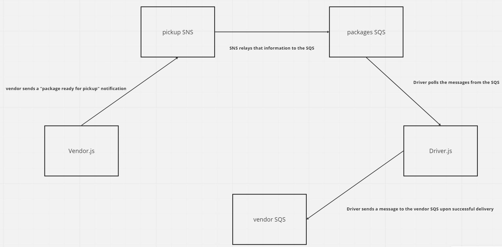

# caps-cloud
This is Lab19 for Code Fellows, Code 401 - JavaScript which aims to recreate the previous CAPS (Code Academy Parcel Service) project using AWS SNS and SQS.

`vendorPickup/vendor.js` will post a 'pickup' message to the SNS topic `vendorPickup`, which contains simulated information like customer name, order id, and a url for their own vendor receipts queue.

The `pendingDelivery` SQS is subscribed to the `vendorPickup` SNS and will receive a copy of the simulated order, from there the `pendingDelivery/drivers.js` module will listen for every message that comes through the `pendingDelivery` SQS and will then simulate the delivery process by waiting a random amount of seconds before sending a 'Successful delivery' message to the vendor recepts queue url.

## UML

